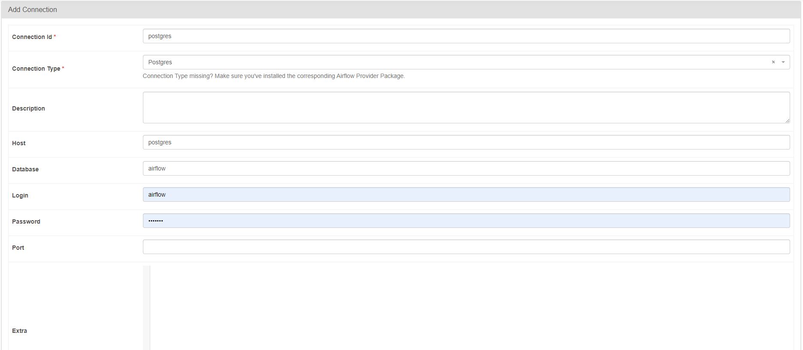

# Realtime Data Streaming Project

## Table of Contents
- [Introduction](#introduction)
- [System Architecture](#system-architecture)
- [Technologies](#technologies)
- [Getting Started](#getting-started)
- [How to Run](#how-to-run)
- [LICENSE](#LICENSE)
- [Status](#status)
## Introduction

This project is my personal implementation of an end-to-end data engineering pipeline. It involves all key stages, from data ingestion and processing to final storage, leveraging a robust tech stack that includes Apache Airflow, Python, Apache Kafka, Apache Zookeeper, Apache Spark, and Hadoop. The entire system is containerized using Docker, ensuring ease of deployment and scalability.

## System Architecture


The project is designed with the following components:

- **Data Source**: We use `binance.com` API to get transfer bitcoin.
- **Apache Airflow**: Responsible for orchestrating the pipeline and storing fetched data in a PostgreSQL database.
- **Apache Kafka and Zookeeper**: Used for streaming data from PostgreSQL to the processing engine.
- **Control Center and Schema Registry**: Helps in monitoring and schema management of our Kafka streams.
- **Apache Spark**: For data processing with its master and worker nodes.
- **Hadoop and Hive**: Where the processed data will be stored.

## Technologies

- Apache Airflow
- Python
- Apache Kafka
- Apache Zookeeper
- Apache Spark
- PostgreSQL
- Docker
- Hadoop
- Hive

## Getting Started

1. Clone the repository:
    ```bash
    https://github.com/binhkhang3169/Kafka-Spark-Crypto-ETL.git
    ```

2. Navigate to the project directory:
    ```bash
    cd Kafka-Spark-Crypto-ETL
    ```

3. Run Docker Compose to spin up the services:
    ```bash
    docker-compose up
    ```
4. Install Kafka Python for Airflow:
    ```bash
    docker exec -it scheduler /bin/bash -c "pip install kafka-python"
    docker exec -it webserver /bin/bash -c "pip install kafka-python"
    ```
5. Setup Hadoop for Spark:
    ```bash
    docker exec -u root -it spark-master /bin/bash
    apt update && apt install -y wget
    wget https://archive.apache.org/dist/hadoop/common/hadoop-3.2.1/hadoop-3.2.1.tar.gz
    tar -xzf hadoop-3.2.1.tar.gz -C /opt/
    export PATH=$PATH:/opt/hadoop-3.2.1/bin
    ```
6. Change the IP of Hadoop in env:
    ```bash
    docker exec -it spark-master cat /etc/hosts 
    echo "172.18.0.8 namenode" >> /etc/hosts
    ```
7. Create table in HiveL
    ```bash
    docker exec -it hive-server hive
    Access sql/data.sql to create Fact_trades
    ```
8. Create connection Postgre for Airflow:
    - Admin -> Connections 

## How to Run
1. Find the IP of Spark:
    ```bash
    docker logs spark-master
    ```

2. Copy steaming data to directory of Spark:
    ```bash
    docker cp -L your\path\pyspark_scripts\steaming_data.py spark-master:/opt/bitnami/spark/streaming_data.py
    ```
3. Run Spark submit:
    ```bash
    docker exec -it spark-master spark-submit --master spark://<spark-master-ip>:7077 --deploy-mode client --conf spark.sql.warehouse.dir=hdfs://namenode:9000/user/hive/warehouse --packages org.apache.spark:spark-sql-kafka-0-10_2.12:3.5.4 test_pyspark.py
    ```
## LICENSE
License of Apache
## Status
Developing
